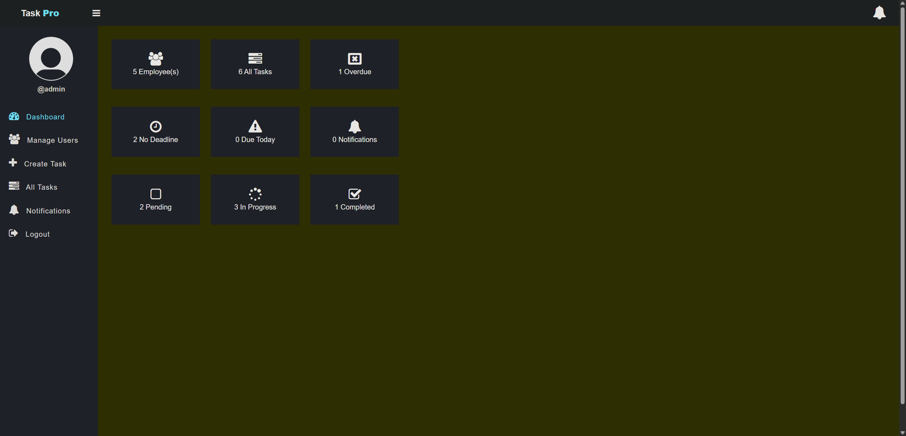
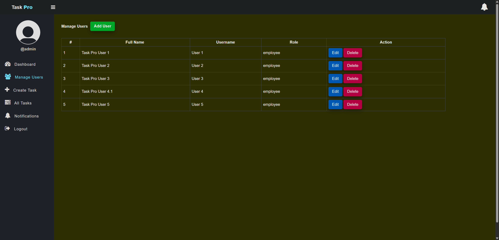
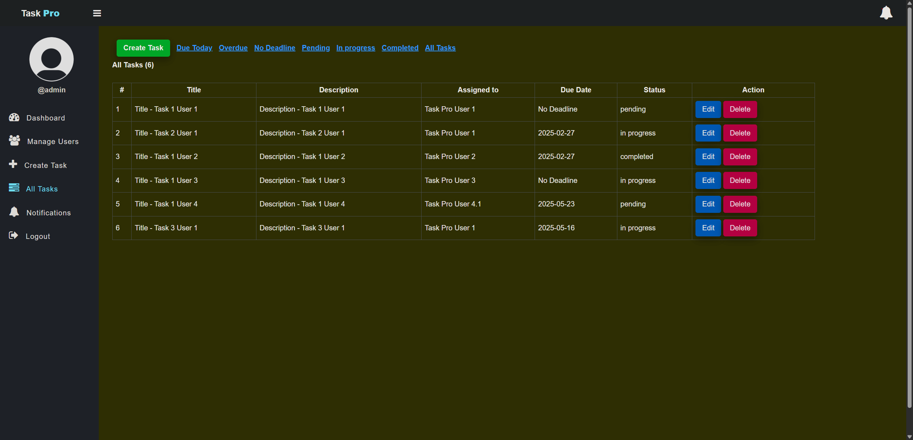
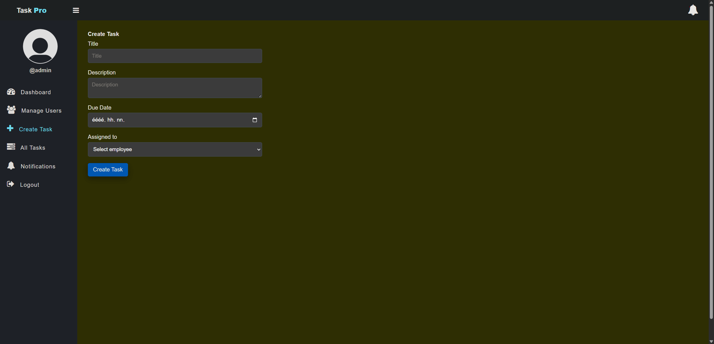
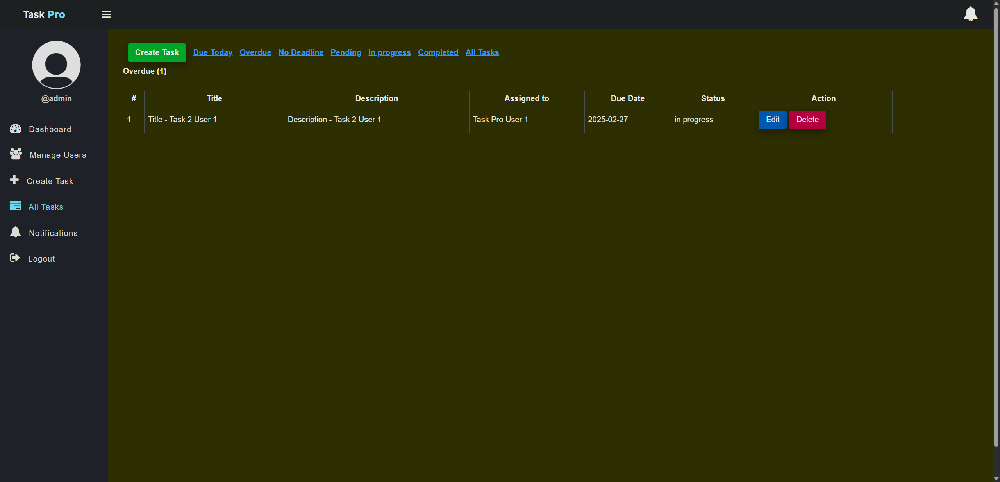
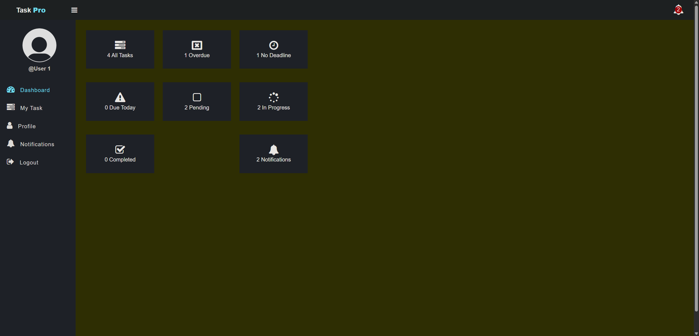
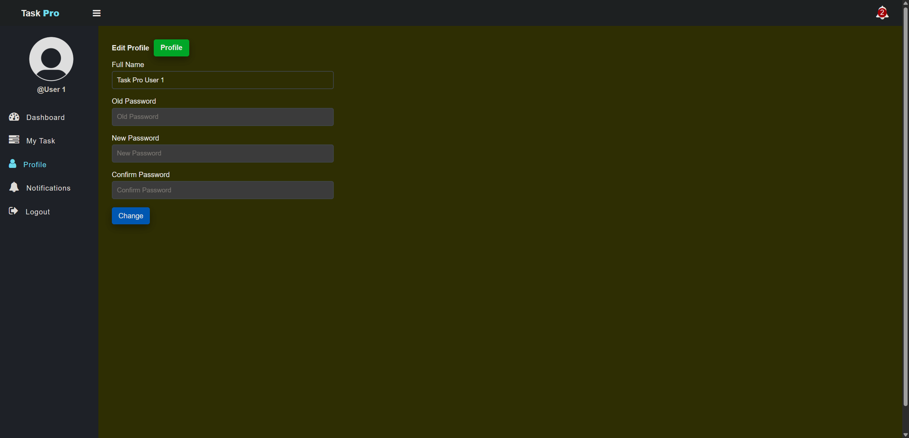
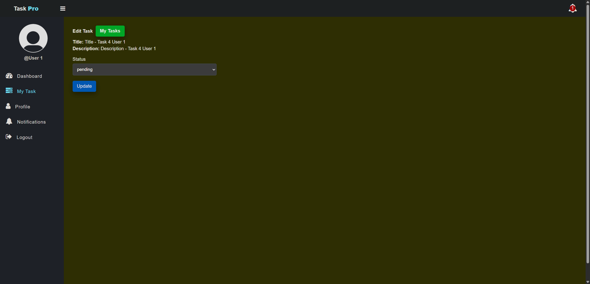
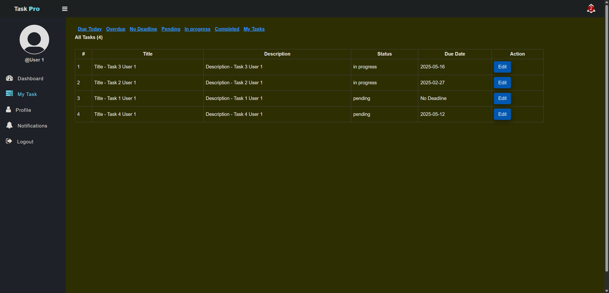
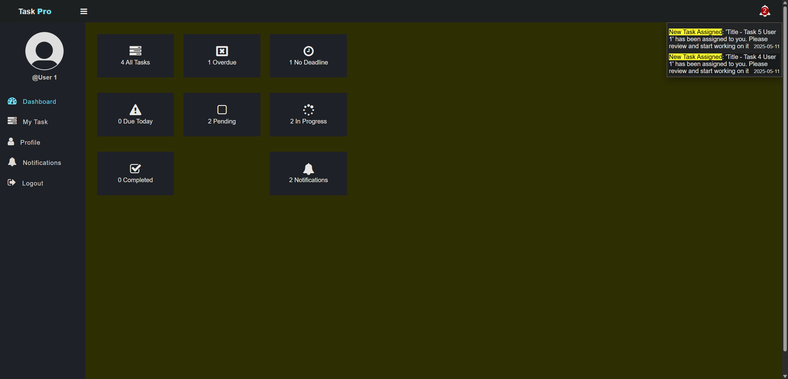

# Employee Task Management System

    Ein webbasiertes System zur Verwaltung von Aufgaben und Mitarbeitern, entwickelt mit PHP und MySQL.

## Inhaltsverzeichnis

- [Überblick](#überblick)
- [Funktionen](#funktionen)
- [Sicherheitsfunktionen](#sicherheitsfunktionen)
- [Ordnerstruktur](#ordnerstruktur)
- [Lizenz](#lizenz)

## Überblick

    Das Employee Task Management System ist eine Anwendung zur Verwaltung von Aufgaben und Mitarbeitern. Es ermöglicht Administratoren, Aufgaben zu erstellen, zu verwalten und Mitarbeitern zuzuweisen, während Mitarbeiter den Status ihrer Aufgaben aktualisieren können. Das System bietet eine einfache Benutzeroberfläche und optimiert die Aufgabenverwaltung in einem Team.

## Funktionen

### Mit Administratorrechten:

 
 

    - Benutzerprofile erstellen, bearbeiten und löschen

 
 

    - Aufgaben erstellen, bearbeiten und löschen

 
 

    - Aufgaben Mitarbeitern zuweisen
    - Fälligkeitsdatum für Aufgaben festlegen

 
 

    - Aufgaben filtern (z. B. nach Status oder Fälligkeitsdatum)

 
 

### Mit Mitarbeiterrechten:

 
 

    - Passwort ändern

 
 

    - Status einer Aufgabe aktualisieren (z. B. "In Bearbeitung", "Erledigt")

 
 

    - Aufgaben filtern

    
 
 

    - Automatische Benachrichtigung bei der Erstellung einer Aufgabe

 
 
 

## Sicherheitsfunktionen

    - Session-Management:
        Die Anwendung verwendet PHP-Sessions, um Benutzeranmeldungen zu verwalten. Dies stellt sicher, dass nur authentifizierte Benutzer auf geschützte Bereiche zugreifen können.
    
    - Authentifizierungsprüfung:
        Benutzer, die nicht angemeldet oder nicht autorisiert sind, werden zur Login-Seite weitergeleitet, um unbefugten Zugriff zu verhindern.
    
    - Rollenbasierte Zugriffskontrolle:
        Die Anwendung unterscheidet zwischen Administratoren und Mitarbeitern und zeigt unterschiedliche Dashboards und Funktionen basierend auf der Benutzerrolle an.
    
    - HTML-Escaping für Benutzereingaben:
        Benutzereingaben (z. B. GET-Parameter) werden mit htmlspecialchars gefiltert, um Cross-Site Scripting (XSS) zu verhindern.
    
    - Eingabevalidierung und -sanitierung:
        Benutzereingaben werden bereinigt und validiert, um sicherzustellen, dass sie keine schädlichen Inhalte enthalten.
    
    - CSRF-Schutz:
        Ein CSRF-Token wird in der Session gespeichert und bei kritischen Aktionen (z. B. Löschen von Benutzern) verwendet. Dies schützt vor Cross-Site Request Forgery (CSRF)-Angriffen.
    
    - Passwort-Hashing
        Passwörter werden mit password_hash gehasht, bevor sie in der Datenbank gespeichert werden. Dies schützt vor der Offenlegung von Passwörtern bei einem Datenbankleck.

    - Schutz vor SQL-Injection
        Die Anwendung verwendet vorbereitete Statements in den Datenbankabfragen, um SQL-Injection zu verhindern.

    - Fehler- und Erfolgsmeldungen:
        Fehler- und Erfolgsmeldungen werden sicher ausgegeben, um XSS-Angriffe zu verhindern.
    
    - Logout-Funktion:
        Die Logout-Funktion zerstört die Session und entfernt alle Session-Daten, um sicherzustellen, dass Benutzer nach dem Abmelden keinen Zugriff mehr haben.

## Ordnerstruktur

    .
    ├── add-user.php
    ├── create_task.php
    ├── DB_connection.php
    ├── DB.sql
    ├── delete-task.php
    ├── delete-user.php
    ├── edit_profile.php
    ├── edit-task-employee.php
    ├── edit-task.php
    ├── edit-user.php
    ├── index.php
    ├── login.php
    ├── logout.php
    ├── my_task.php
    ├── notifications.php
    ├── profile.php
    ├── tasks.php
    ├── user.php
    ├── app/
    │   ├── add-task.php
    │   ├── add-user.php
    │   ├── login.php
    │   ├── notification-count.php
    │   ├── notification-read.php
    │   ├── notification.php
    │   ├── update-profile.php
    │   ├── update-task-employee.php
    │   ├── update-task.php
    │   ├── update-user.php
    │   ├── Helpers/
    │   │   ├── task_filters.php            # Funktionen zur Filterung von Aufgaben 
    │   │   ├── task_functions.php          # Logik für Aufgabenoperationen 
    │   │   ├── user_functions.php          # Logik für Benutzeroperationen 
    │   │   └── validation_functions.php    # Validierungsfunktionen 
    │   ├── Model/
    │   │   ├── Notification.php            # Modell für Benachrichtigungen 
    │   │   ├── Task.php                    # Modell für Aufgaben 
    │   │   └── User.php                    # Modell für Benutzer 
    ├── css/
    │   └── style.css                       # Stile für die Benutzeroberfläche 
    ├── img/                                # Verzeichnis für Bilder 
    ├── inc/
    │   ├── header.php                      # Header-Komponente 
    │   ├── nav.php                         # Navigationsleiste 

## Lizenz

    Dieses Projekt ist unter der MIT-Lizenz lizenziert. Weitere Informationen findest du in der [LICENSE](LICENSE) Datei.